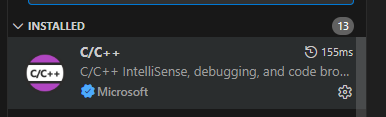
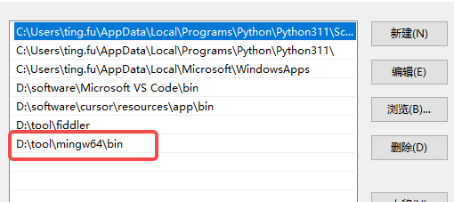
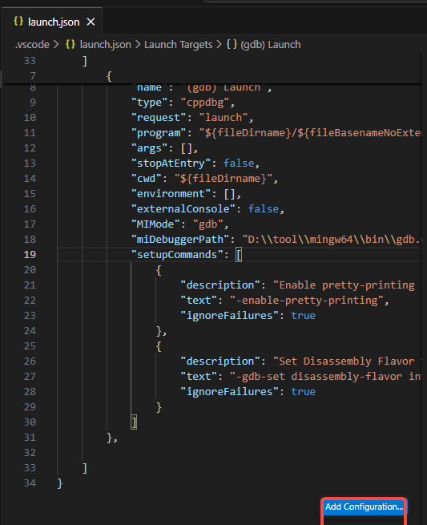
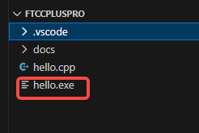

1. vscode

2.vscode 拓展


3.安装C++编译器
下载连接

https://sourceforge.net/projects/mingw-w64/files/Toolchains%20targetting%20Win64/Personal%20Builds/mingw-builds/8.1.0/threads-posix/sjlj/x86_64-8.1.0-release-posix-sjlj-rt_v6-rev0.7z/download


4.解压3后配置环境变量


5.查看配置是否成功


5.新建一个空文件目录


6.新建一个cpp文件
```c++
#include <iostream>

using namespace std;

int main(){
    cout<<"hello world";
}
``

7.点击编译
会自动生成没有内容的launch.josn
点击右下角添加配置

```c++
{
    // Use IntelliSense to learn about possible attributes.
    // Hover to view descriptions of existing attributes.
    // For more information, visit: https://go.microsoft.com/fwlink/?linkid=830387
    "version": "0.2.0",
    "configurations": [
        {
            "name": "(gdb) Launch",
            "type": "cppdbg",
            "request": "launch",
            "program": "${fileDirname}/${fileBasenameNoExtension}.exe", //修改的
            "args": [],
            "stopAtEntry": false,
            "cwd": "${fileDirname}",
            "environment": [],
            "externalConsole": false,
            "MIMode": "gdb",
            "miDebuggerPath": "D:\\tool\\mingw64\\bin\\gdb.exe",//修改的
            "setupCommands": [
                {
                    "description": "Enable pretty-printing for gdb",
                    "text": "-enable-pretty-printing",
                    "ignoreFailures": true
                },
                {
                    "description": "Set Disassembly Flavor to Intel",
                    "text": "-gdb-set disassembly-flavor intel",
                    "ignoreFailures": true
                }
            ]
        },

    ]
}
```

不知道啥时候又生成了一个task.json文件，不过不重要

此时就可以正常输出了，输出后会自动生成一个对应的hello.exe
